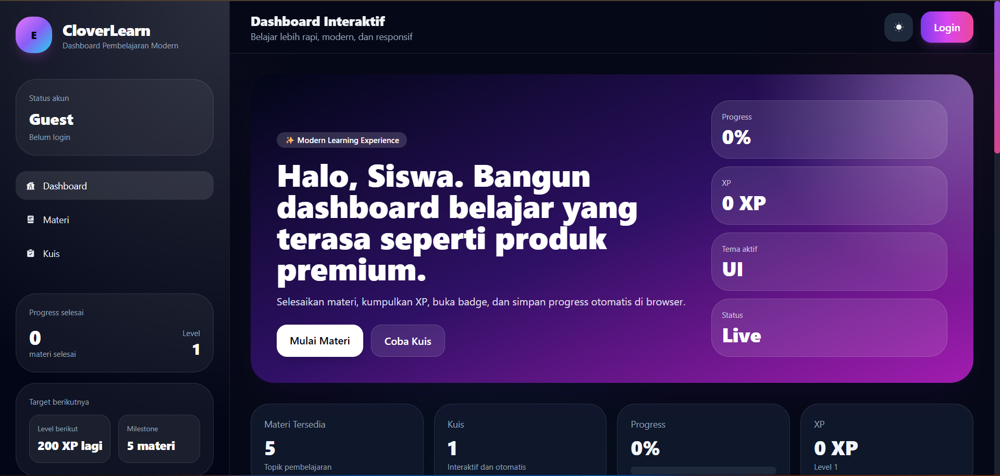
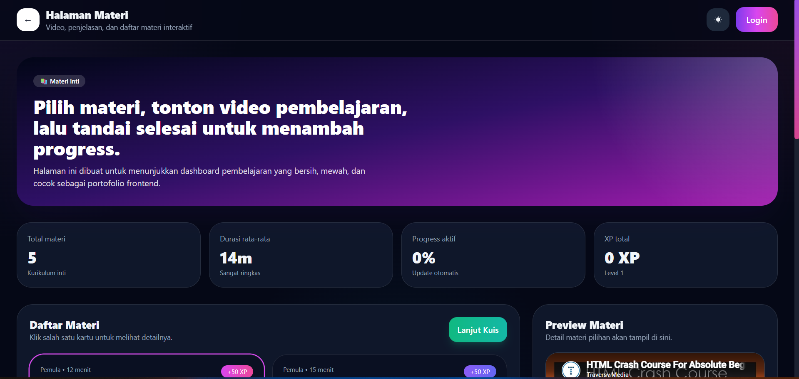
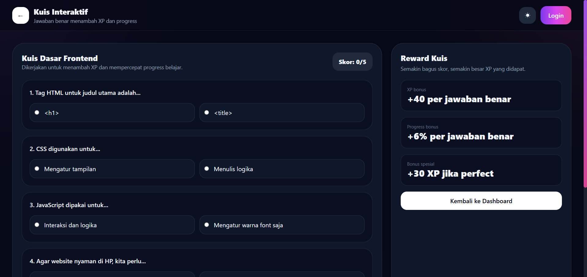

# CloverLearn Dashboard

## 📌 Deskripsi

CloverLearn adalah dashboard media pembelajaran berbasis web yang dibuat menggunakan HTML, Tailwind CSS, dan JavaScript.

Project ini dikembangkan sebagai bagian dari tugas LKPD 12 dengan menerapkan Git workflow seperti industri frontend developer.

## 🚀 Fitur

* Dashboard interaktif
* Halaman materi pembelajaran
* Kuis interaktif
* Sistem XP dan progress
* Dark mode
* Login UI sederhana
* Penyimpanan data menggunakan LocalStorage

## 🛠️ Teknologi

* HTML
* Tailwind CSS
* JavaScript
* Git & GitHub

## 📷 Screenshot

## 🔗 Repository

https://github.com/alraz18/elearning-dashboard

## 👨‍💻 Author

Nama: alraz18
